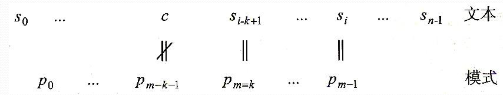
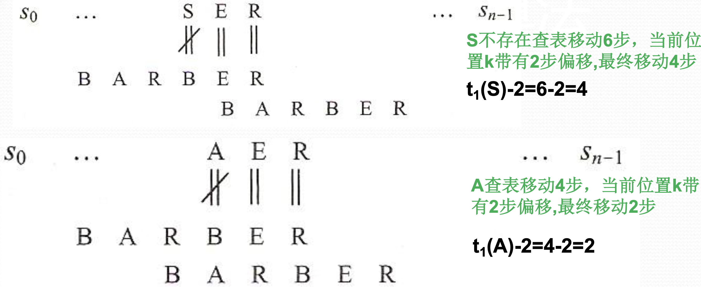
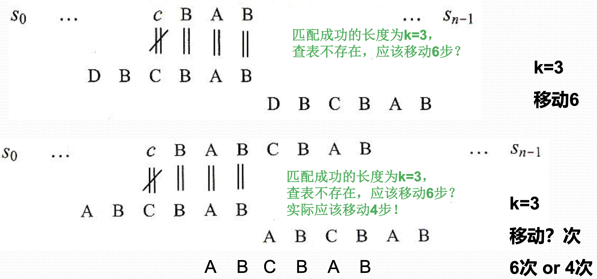
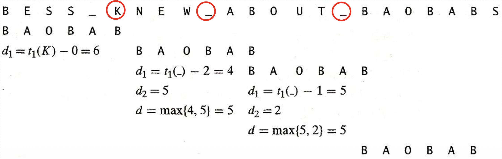

# [基础算法学习] 字符串匹配还在用暴力？(二) Boyer-Moore算法：终极优化版本

---

> 💡 **阅读提示**：本文的前置知识为 Horspool 算法，建议先阅读上一篇：  
> 👉 [[基础算法学习] 字符串匹配还在用暴力？(一) Horspool算法：高效的跳跃术](https://blog.csdn.net/qwertyui666/article/details/155365393?spm=1011.2415.3001.5331)

---

## 一、Horspool算法回顾

在上一篇文章中，我们学习了 Horspool 算法——通过**预处理**模式串 ($Pattern$) 构建移动表（坏字符表），实现了高效的字符串匹配。

今天，我们来看看 Boyer-Moore (BM) 算法如何通过增加**好后缀规则**来进一步优化！

---

## 二、从一个场景说起

在字符串匹配过程中，经常会遇到下面这种情况：



文本已经与模式有 $k$ 个字符完成匹配（右侧部分）

但是字符 $c$ 与 $P_{m-k-1}$ 匹配**失败**

这种情况下，Horspool 算法和 Boyer-Moore 算法的处理方式会出现**显著差异**。

---

## 三、两种算法的处理差异

### 3.1 Horspool 的处理方式

**核心原则**：不管什么情况，始终查看**文本中与模式末尾对齐的字符** $s_i$ 来决定移动距离。

**移动距离**：$t(s_i)$

其中，移动表函数 $t$ 定义如下：

$$
t(c) = \begin{cases}
m & \text{如果 } c \text{ 不在模式的前 } m-1 \text{ 个字符中} \\
\text{模式前 } m-1 \text{ 个字符中最右的 } c \text{ 到末尾的距离} & \text{如果 } c \text{ 在模式的前 } m-1 \text{ 个字符中}
\end{cases}
$$


> 💭 如果忘记了 Horspool 算法，可以回到上一篇复习一下。

---

### 3.2 Boyer-Moore 的处理方式

BM 算法更加**智能**，它通过**两个规则**来确定模式移动距离：
1. **坏字符规则**（Bad Character Rule）
2. **好后缀规则**（Good Suffix Rule）

然后取两者的**最大值**，实现更大步长的跳跃！

---

## 四、Boyer-Moore 核心规则详解

### 4.1 规则一：坏字符规则

#### 定义

**坏字符**：文本中从右向左**第一个没有与模式匹配上的字符**。

> ⚠️ **注意**：坏字符一定是**文本中**的字符，如上图中的 $c$。

#### 移动距离计算

设当前文本与模式已经成功匹配 $k$ 个字符，文本中的坏字符为 $c$，那么坏字符规则的移动距离 $d_1$ 为：

$$
d_1 = \max(t(c) - k, 1)
$$

**公式解释**：
- $t(c)$：字符 $c$ 在模式中的移动距离（类似 Horspool）
- $k$：已匹配的字符数
- $\max(..., 1)$：确保至少移动 1 个位置

#### 示例



在这个例子中：
- 坏字符是 $c$
- 已匹配 $k$ 个字符
- 根据 $t(c)$ 和 $k$ 计算出 $d_1$

---

### 4.2 规则二：好后缀规则

#### 定义

**好后缀**：模式串末尾长度为 $k$ 的**已匹配部分**，记作 $suff(k)$。

> 💡 **核心思想**：利用已经匹配成功的信息，寻找模式中是否还有相同的子串。

#### 移动距离计算

好后缀规则需要分**两种情况**讨论：

---

#### **情况 1**：模式中存在多个 $suff(k)$

当模式中存在**两个或以上** $suff(k)$ 时，移动距离 $d_2$ 等于**从右数第二个** $suff(k)$ 到**最右边的** $suff(k)$ 之间的距离。

**示例**：

| 模式串 | 好后缀 | $d_2$ | 说明 |
|--------|--------|-------|------|
| <u>AB</u>C<u>AB</u> | AB | 3 | 将第一个 AB 对齐到末尾的 AB |
| <u>B</u>ABC<u>B</u>AB | B | 2 | 将倒数第二个 B 对齐到末尾的 B |
| A<u>B</u>C<u>B</u>AB | AB | 4 | 将 AB 对齐 |

**直观理解**：
```
模式: A B C B A B
     -------
好后缀:     B A B
           ↓
对齐到: B A B
       -----
移动: A B C B A B
         ↑
      距离为 3
```

---

#### **情况 2**：模式中只有一个 $suff(k)$

这是最复杂但也最精妙的情况！看下面这个例子：



**问题**：后缀 $BAB$ 在模式中只出现了一次。如果简单地移动整个模式长度，可能会**漏掉匹配**！

**解决方案**：寻找**最长的前缀**，使得它能够与某个**后缀的后缀**匹配。

**具体步骤**：
1. 找出长度为 $l < k$ 的**最长前缀**
2. 该前缀能够与长度为 $l$ 的后缀进行匹配
3. 如果存在这样的前缀，$d_2$ = 模式长度 - 前缀长度
4. 如果不存在，$d_2 = m$（整个模式长度）

**示例说明**：
```
模式: C A B A B
好后缀:   B A B (长度 k=3)

虽然 BAB 只出现一次，但：
- 前缀 AB 可以与后缀 AB 匹配 (l=2)
- 这样移动后不会漏掉可能的匹配

移动方案：
C A B A B
    ↓ 移动
    C A B A B
```

---

### 4.3 BM 算法的最终公式

综合坏字符规则和好后缀规则，得到 BM 算法的移动距离公式：

$$
d = \begin{cases}
d_1 & \text{如果 } k = 0 \text{ (没有匹配字符)} \\
\max(d_1, d_2) & \text{如果 } k > 0 \text{ (有匹配字符)}
\end{cases}
$$

其中：
- $d_1 = \max(t(c) - k, 1)$（坏字符规则）
- $d_2$：好后缀规则计算得出

**核心策略**：<span style="color: red;">**取两个规则中移动距离的最大值**</span>，实现最大化跳跃！

---

## 五、完整示例演示

让我们通过一个完整的例子来理解 BM 算法：



---

## 六、代码实现

### 6.1 构建坏字符表
```python
def build_bad_char_table(pattern):
    """构建坏字符表（与 Horspool 相同）"""
    m = len(pattern)
    table = {}
    
    # 只考虑前 m-1 个字符
    for i in range(m - 1):
        table[pattern[i]] = m - 1 - i
    
    return table
```

### 6.2 构建好后缀表
```python
def build_good_suffix_table(pattern):
    """构建好后缀表"""
    m = len(pattern)
    good_suffix = [0] * m
    suffix = [0] * m
    
    # 步骤 1：计算 suffix 数组
    # suffix[i] 表示从位置 i 开始与后缀匹配的最长长度
    suffix[m - 1] = m
    for i in range(m - 2, -1, -1):
        j = i
        while j >= 0 and pattern[j] == pattern[m - 1 - i + j]:
            j -= 1
        suffix[i] = i - j
    
    # 步骤 2：情况 2 - 前缀匹配后缀
    for i in range(m):
        good_suffix[i] = m
    
    j = 0
    for i in range(m - 1, -1, -1):
        if suffix[i] == i + 1:  # 找到前缀
            while j < m - 1 - i:
                if good_suffix[j] == m:
                    good_suffix[j] = m - 1 - i
                j += 1
    
    # 步骤 3：情况 1 - 模式中存在相同子串
    for i in range(m - 1):
        good_suffix[m - 1 - suffix[i]] = m - 1 - i
    
    return good_suffix
```

### 6.3 完整的 Boyer-Moore 算法
```python
def boyer_moore(text, pattern):
    """
    Boyer-Moore 字符串匹配算法
    
    参数:
        text: 文本串
        pattern: 模式串
    
    返回:
        匹配的起始位置，未找到返回 -1
    """
    n, m = len(text), len(pattern)
    
    if m == 0:
        return 0
    if m > n:
        return -1
    
    # 预处理：构建两个表
    bad_char = build_bad_char_table(pattern)
    good_suffix = build_good_suffix_table(pattern)
    
    i = 0  # 文本中的当前位置
    
    while i <= n - m:
        j = m - 1  # 从模式末尾开始匹配
        k = 0      # 已匹配的字符数
        
        # 从右向左进行匹配
        while j >= 0 and pattern[j] == text[i + j]:
            j -= 1
            k += 1
        
        if j < 0:
            # 完全匹配
            return i
        else:
            # 计算两个规则的移动距离
            # 坏字符规则
            bad_char_shift = max(bad_char.get(text[i + j], m) - k, 1)
            
            # 好后缀规则
            good_suffix_shift = good_suffix[j] if k > 0 else m
            
            # 取最大值
            i += max(bad_char_shift, good_suffix_shift)
    
    return -1
```

---

## 七、时间复杂度分析

### 7.1 预处理阶段

**坏字符表**：
- 时间复杂度：$O(m + \sigma)$
- 空间复杂度：$O(\sigma)$
- 其中 $\sigma$ 是字符集大小

**好后缀表**：
- 时间复杂度：$O(m)$
- 空间复杂度：$O(m)$

**预处理总计**：$O(m + \sigma)$

### 7.2 匹配阶段

**最好情况**：$O(\frac{n}{m})$
- 每次失配都能跳过 $m$ 个字符
- 例如：模式为 `AAAB`，文本为 `BBBBBBBBB`
- 每次比较第一个字符就失配，直接跳过整个模式长度

**最坏情况**：$O(mn)$
- 虽然理论上存在，但实际很少出现
- 例如：模式 `AAAA`，文本 `AAAAAAAAAB`
- 每次都要匹配到最后一个字符才失配

---

## 相关文章

- [[基础算法学习] 字符串匹配还在用暴力？(一) Horspool算法：高效的跳跃术](https://blog.csdn.net/qwertyui666/article/details/155365393)

---

如果这篇文章对你有帮助，不妨**点个赞 👍，留个收藏 ⭐**，你的支持是我持续创作的动力！

有任何疑问欢迎在评论区讨论~