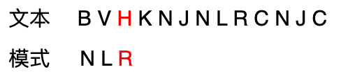
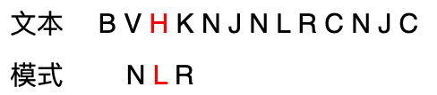
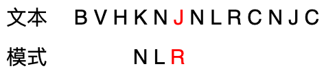
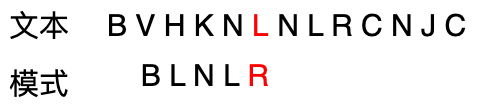
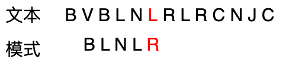
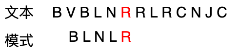

# [基础算法学习] 说些你可能不知道的字符串匹配:Boyer-Moore算法

---
## 经典字符串匹配问题
要求在一个较长的n个字符的字符串(称为**文本**)中，寻找一个给定的m个字符的字符串(称为**模式**)

### 1.暴力法
简单地从左到右比较模式和文本中每一个对应的字符，如果不匹配，把文本向右移动一个，再进行下一轮尝试，最差效率为$O(mn)$.

参考下图：


#### 代码实现
```python
def brute_force(text, pattern):
    """暴力匹配算法"""
    n, m = len(text), len(pattern)
    
    for i in range(n - m + 1):
        j = 0
        #匹配模式的每一个字符
        while j < m and text[i + j] == pattern[j]:
            j += 1
        if j == m:
            return i  # 找到匹配
    return -1  # 未找到
```

### 2.由暴力法引发的思考
#### 2.1 第一种优化
在暴力法中，对于文本中的每一个字符，我们让其都遍历了一次模式。换句话说，文本中的任意一个字符都和模式中的所有字符比较过，因为模式每一次都只是移动一个单位。
这些比较中，一定存在非必要的比较！请看如下例子：

在第一个图中，我们进行了如下比较：



此时文本中的$H$对应模式中的$R$。按照暴力法，由于两者不匹配，模式需要移动一个单位，如下图：



但是仔细观察一下，模式$NLR$中根本就没有$H$。这种移动比较是没有意义的，所以我们应该直接跳过$H$，来到下图的情形。



由此我们得到第一种优化方式：**根据文本和模式尾部对齐的字符$c$，如果模式中不含$c$,模式安全移动的距离就是它的<font color="red">全部长度$m$</font>**

#### 2.2 第二种优化
如果模式中包含字符$c$呢？我们来看下图情形：



字符$L$确实在模式中，并且不是模式的最后一个字符，那么我们一定考虑将两个$L$对齐。但是这个例子的问题在于：模式里面有两个$L$，应该对齐哪一个？

很显然，要对齐最右边的$L$，这样可以不漏掉所有情况，看下图情形就能够明白:



在这种情况下，显然我们只要移动一位，就能得到答案，也就是最右边的$L$和文本中的$L$对齐。

由此，得到第二种优化方式：**模式中存在$c$，并且$c$在模式中不是最后一位，可以将模式移动到<font color = "red">最右的$c$与文本中的$c$对齐</font>**

#### 2.3 第三种优化
接着第一种优化的思路：如果文本中的$c$是模式中的最后一位，并且模式中不含有其他的$c$呢？

参考下图情形：



不难发现，与第一种优化一样，直接移动模式长度$m$，因为文本中的$R$在模式中除了最后一位根本不存在，就没有比较的意义。

由此，得到第三种优化：**模式中含有$c$且只是最后一位，模式移动$m$单位**。


#### 2.4 第四种优化
类似第二种优化思路，如果模式与文本末尾对齐$c$，并且模式中除了末尾外还有其他$c$,我们可以直接得到优化思路

第四种优化思路：**模式与文本末尾对齐$c$并且模式含有多个$c$,可以讲模式移动到最右面的$c$与文本$c$对齐**。

### 3. 最种优化结论