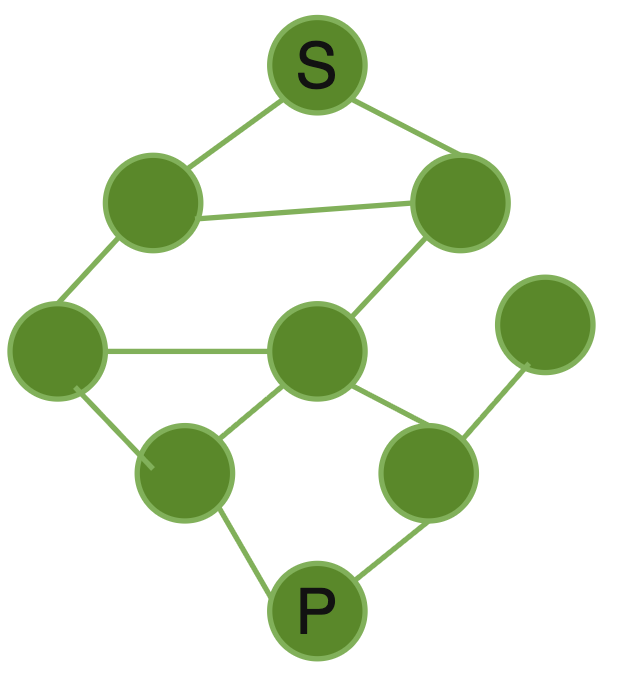

# [基础算法学习] 图解DFS与BFS：从入门到精通

---
想象你在一个迷宫中寻找出口：一种方法是选择一条路一直走到底，走不通再回头换路；另一种是先把周围一圈都探索一遍，再向外扩展。这正是深度优先搜索(DFS)和广度优先搜索(BFS)的核心思想。作为算法中最基础的两种遍历方式，它们几乎出现在所有涉及图、树、搜索的问题中，是每个算法学习者必须掌握的基本功。
本文将从原理、图解、代码实现三个方面以此解析DFS与BFS，带你掌握这两种重要的算法

## 算法背景
想象你在规划一次旅行，有很多景点通过道路相连。给定起点$S$和终点$T$，你想知道：
- 能否从$S$到达$T$？
- 如果能到达，最少需要经过几个景点？（最短路径）
- 有哪些不同的路线可以选择？
参考下图：

这些都是图的遍历问题，而DFS和BFS就是解决这类问题的两大基础算法。
## 深度优先搜索(DFS)
### 原理
简单来说，DFS的核心思想就是**沿着一条路走到头，走不通了再回溯**。

具体来说，从起点出发后，DFS会选择一个方向一直深入探索，直到无路可走或者找到目标。此时再回退到上一个节点，换一个方向继续深入。这个过程就像走迷宫时"一条道走到黑"的策略——先把一条路探索完，再换下一条。
