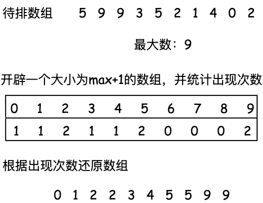

# [基础算法学习] 用「人话」讲懂所有常见排序算法，小白秒懂(附Leetcode练习题)

---

**推荐题单**：
#### 🟢 基础题（必做）
1. [912. 排序数组](https://leetcode.cn/problems/sort-an-array/) ⭐⭐⭐
2. [242. 有效的字母异位词](https://leetcode.cn/problems/valid-anagram/)
3. [1365. 有多少小于当前数字的数字](https://leetcode.cn/problems/how-many-numbers-are-smaller-than-the-current-number/)
4. [1122. 数组的相对排序](https://leetcode.cn/problems/relative-sort-array/)
5. [976. 三角形的最大周长](https://leetcode.cn/problems/largest-perimeter-triangle/)

#### 🟡 进阶题
6. [75. 颜色分类](https://leetcode.cn/problems/sort-colors/) ⭐⭐⭐
7. [147. 对链表进行插入排序](https://leetcode.cn/problems/insertion-sort-list/)
8. [148. 排序链表](https://leetcode.cn/problems/sort-list/) ⭐⭐⭐
9. [215. 数组中的第K个最大元素](https://leetcode.cn/problems/kth-largest-element-in-an-array/)
10. [324. 摆动排序 II](https://leetcode.cn/problems/wiggle-sort-ii/)

#### 🔴 挑战题
11. [493. 翻转对](https://leetcode.cn/problems/reverse-pairs/)
12. [315. 计算右侧小于当前元素的个数](https://leetcode.cn/problems/count-of-smaller-numbers-after-self/)
---

**根据需求跳转**：
- [冒泡排序](#冒泡排序)
- [选择排序](#选择排序)
- [计数排序](#计数排序)
- [插入排序](#插入排序)
- [归并排序](#归并排序)
- [快速排序](#快速排序)
---

排序算法是算法入门的第一道关卡，掌握它的原理与实现，是你真正入门算法的标志。本文用最通俗的语言，带你彻底搞懂这些必学的排序算法。建议收藏慢慢看，也可以直接跳转到你需要的部分。

---

## 冒泡排序
冒泡排序是最经典、最容易理解的排序算法，堪称"暴力法"的代表。它的名字很形象——就像水中的气泡，大的泡泡会一路上浮到水面。

**一句话理解冒泡**：从头开始，相邻两个数比大小，大的往后挪，小的往前挪。一轮下来，最大的数就"冒"到了末尾。然后再来一轮，第二大的数也到位了，依此类推。

**原理演示**：https://visualgo.net/en/sorting 

### 时间复杂度分析

设 `n` 代表数组长度：

- **第 1 轮**：需要比较 `n-1` 次，确定最后一位是最大值
- **第 2 轮**：需要比较 `n-2` 次，确定倒数第二位
- **第 3 轮**：需要比较 `n-3` 次
- ...
- **第 n-1 轮**：需要比较 `1` 次

因此总比较次数为：

$$T(n) = (n-1) + (n-2) + ... + 2 + 1 = \frac{n(n-1)}{2} = O(n^2)$$

### 空间复杂度分析
整个过程中没有开辟新的空间，在原数组上进行原地操作，因此空间复杂度为 $O(1)$

### 代码实现
```python
def bubbleSort(arr):
    n = len(arr)
    
    # 外层循环进行n-1次
    for i in range(n-1):
        for j in range(n - i - 1):
            if arr[j] > arr[j + 1]:
                arr[j],arr[j+1] = arr[j+1],arr[j]
    return arr
```

---

## 选择排序
选择排序同样是暴力法的一种，但比冒泡排序更加直观易懂。

**一句话理解选择排序**：每次**从未排序部分找出最小值，放到已排序部分的末尾**。第一轮找到最小值放第一位，第二轮找到第二小的放第二位，依此类推。

**原理演示**：https://visualgo.net/zh/sorting?slide=8

### 与冒泡排序的区别

- **冒泡排序**：通过相邻元素的反复交换，把最大值"冒"到末尾
- **选择排序**：直接选出最小值，一次交换放到正确位置

**核心差异**：
- 冒泡：每轮可能交换多次
- 选择：每轮只交换一次（找到最小值后再交换）

### 时间复杂度分析

设 `n` 代表数组长度：

- **第 1 轮**：遍历 `n` 个元素找最小值，比较 `n-1` 次
- **第 2 轮**：遍历剩余 `n-1` 个元素，比较 `n-2` 次
- **第 3 轮**：遍历剩余 `n-2` 个元素，比较 `n-3` 次
- ...
- **第 n-1 轮**：遍历剩余 `2` 个元素，比较 `1` 次

因此总比较次数为：

$$T(n) = (n-1) + (n-2) + ... + 2 + 1 = \frac{n(n-1)}{2} = O(n^2)$$

**关键点**：
- 无论数组是否有序，选择排序都需要完整遍历找最小值
- 因此**最好、最坏、平均情况**时间复杂度都是 $O(n^2)$

### 空间复杂度分析
与冒泡排序相同，没有开辟新的空间，在原数组上进行原地操作，因此空间复杂度为 $O(1)$

### 代码实现
```python
def selectSort(arr):
    n = len(arr)
    for i in range(n - 1):
        min_idx = i
        
        # 找最小值的索引
        for j in range(i + 1, n):
            if arr[j] < arr[min_idx]:
                min_idx = j
        
        # 只有当最小值不是当前位置时才交换
        if min_idx != i:
            arr[i], arr[min_idx] = arr[min_idx], arr[i]
    
    return arr     
```

---
## 计数排序
计数排序是一种**非比较型**排序算法，时间复杂度可以达到惊人的 $O(n)$！但先别激动，它是用**空间换时间**，而且有严格的使用条件。

**一句话理解计数排序**：开一个数组统计每个数出现了几次，然后按顺序把数字"还原"出来。

**核心思想**：
1. 找出数组中的最大值 `max_val`
2. 创建长度为 `max_val + 1` 的计数数组
3. 统计每个数字出现的次数
4. 按顺序输出

**适用条件**（重要！）：
- ✅ 数据范围较小（如成绩 0-100，年龄 0-150）
- ✅ 非负整数（或可以映射为非负整数）
- ❌ 不适合数据范围过大的情况（会浪费大量空间）

**原理演示**：https://visualgo.net/zh/sorting?slide=15，也可以参考下图：



### 时间复杂度分析

设 `n` 为数组长度，`k` 为数据范围（最大值）：

- 遍历数组找最大值：$O(n)$
- 统计每个数字出现次数：$O(n)$
- 按顺序输出结果：$O(n + k)$

**总时间复杂度**：$O(n + k)$

当 $k$ 相对较小时，时间复杂度近似为 $O(n)$；但当 $k$ 远大于 $n$ 时，时间复杂度主要由 $k$ 决定。

### 空间复杂度分析

需要开辟计数数组，大小为 `max_val + 1`，因此空间复杂度为 $O(k)$，其中 $k = \max(\text{arr}) + 1$

**关键问题**：如果数据范围很大但元素很少（如对 `[1, 1000000]` 排序），会造成巨大的空间浪费！

### 代码实现
```python
def countSort(arr):
    max_val = max(arr)
    cnt = [0]*(max_val + 1)
    res = []
    for num in arr:
        cnt[num] += 1
    for i in range(max_val + 1):
        while cnt[i] > 0:
            res.append(i)
            cnt[i] -= 1
    return res
```

## 插入排序
插入排序是一种简单直观的排序算法，它的工作原理就像**整理扑克牌**一样——抓到一张新牌，就把它插入到手中已经排好序的牌的正确位置。

**一句话理解插入排序**：将数组分为"已排序"和"未排序"两部分，每次从未排序部分取出一个元素，插入到已排序部分的正确位置。

**核心思想**：
1. 从第二个元素开始，认为第一个元素已经排好序
2. 取出当前元素，在已排序部分从后向前扫描
3. 如果已排序元素大于当前元素，就将它后移一位
4. 找到正确位置后，插入当前元素
5. 重复步骤 2-4，直到所有元素排序完成

**原理演示**：
为了方便大家理解，这里直接上扑克牌：


### 时间复杂度分析

$$T(n) = 1 + 2 + ... + (n-1) = \frac{n(n-1)}{2} = O(n^2)$$

- 最好情况（已排序）：$O(n)$
- 最坏情况（逆序）：$O(n^2)$
- 平均情况：$O(n^2)$

**特点**：对接近有序的数组效率很高！

### 空间复杂度分析

原地排序，空间复杂度 $O(1)$


### 代码实现
```python
def insertionSort(arr):
    for i in range(1, len(arr)):
        key = arr[i]        # 取出红色部分的第一张牌（箭头指向的）
        j = i - 1           # 从绿色部分最后一张开始比较
        
        # 在绿色部分找到正确位置
        while j >= 0 and arr[j] > key:
            arr[j + 1] = arr[j]  # 大的牌往后挪
            j -= 1
        
        arr[j + 1] = key    # 插入到正确位置
```


## 归并排序
从这里开始，排序的时间复杂度提升到 $O(n \log n)$，是真正高效的排序算法，需要重点掌握！

归并排序是**分治思想**的经典应用，也是学习递归的绝佳例子。

**一句话理解归并排序**：把数组不断**二分**成更小的部分，分到最小后再**合并**成有序数组。核心是"分而治之"——先分解，再合并。

**核心思想**：
1. **分解**：将数组从中间分成两半，递归地对左右两部分排序
2. **合并**：将两个已排序的子数组合并成一个有序数组

**原理演示**：


### 时间复杂度分析

- 分解：$\log n$ 层
- 每层合并：$O(n)$
- 总复杂度：$O(n \log n)$

**特点**：无论数组初始状态如何，都是 $O(n \log n)$，性能稳定！

### 空间复杂度分析

需要额外空间存储合并结果，空间复杂度 $O(n)$

### 代码实现：
```python
def mergeSort(arr):
    # 递归终止：单个元素已排序
    if len(arr) <= 1:
        return arr
    
    # 【分解】：从中间分成两半
    mid = len(arr) // 2
    left = mergeSort(arr[:mid])    # 递归排序左半部分（向下）
    right = mergeSort(arr[mid:])   # 递归排序右半部分（向下）
    
    # 【合并】：将两个有序数组合并（向上）
    return merge(left, right)


def merge(left, right):
    """合并两个有序数组"""
    result = []
    i = j = 0
    
    # 比较两个数组，取较小的
    while i < len(left) and j < len(right):
        if left[i] <= right[j]:
            result.append(left[i])
            i += 1
        else:
            result.append(right[j])
            j += 1
    
    # 添加剩余元素
    result.extend(left[i:])
    result.extend(right[j:])
    
    return result
```

## 快速排序
快速排序是**实际应用中最常用的排序算法**，平均时间复杂度 $O(n \log n)$，而且是**原地排序**！它也是分治思想的经典应用，但思路和归并排序完全不同。

**一句话理解快速排序**：选一个基准值（pivot），把比它小的放左边，比它大的放右边，然后递归地对左右两部分重复这个过程。

**核心思想**：
1. **选择基准值**（pivot）：通常选第一个、最后一个或随机元素
2. **分区**（partition）：将数组分成两部分，左边都 ≤ pivot，右边都 > pivot
3. **递归排序**：对左右两部分分别进行快速排序

**原理演示**：

### 代码实现：
```python
def quickSort(arr, left=0, right=None):
    """快速排序"""
    if right is None:
        right = len(arr) - 1
    
    # 递归终止条件
    if left >= right:
        return arr
    
    # 分区，返回 pivot 的最终位置
    pivot_index = partition(arr, left, right)
    
    # 递归排序左右两部分
    quickSort(arr, left, pivot_index - 1)
    quickSort(arr, pivot_index + 1, right)
    
    return arr


def partition(arr, left, right):
    """
    分区函数：将数组分成小于 pivot 和大于 pivot 两部分
    返回 pivot 的最终位置
    """
    # 选择最右边的元素作为 pivot
    pivot = arr[right]
    i = left  # i 指向"小于 pivot 区域"的下一个位置
    
    # 遍历 left 到 right-1
    for j in range(left, right):
        if arr[j] <= pivot:
            # 找到小于 pivot 的元素，交换到左边
            arr[i], arr[j] = arr[j], arr[i]
            i += 1
    
    # 将 pivot 放到正确位置
    arr[i], arr[right] = arr[right], arr[i]
    
    return i  # 返回 pivot 的位置
```
### 时间复杂度分析

- **平均情况**：$O(n \log n)$ 
- **最坏情况**：$O(n^2)$（数组已反向排序）
- **避免最坏**：随机选择 pivot

### 空间复杂度分析

递归栈空间：$O(\log n)$（原地排序）


## 总结

恭喜你！🎉 看到这里，你已经掌握了算法入门最重要的排序算法。让我们回顾一下：

### 基础排序（$O(n^2)$）
- **冒泡排序**：相邻比较，大的后移，简单但低效
- **选择排序**：每次选最小值，交换次数少
- **插入排序**：像整理扑克牌，对接近有序的数组效率高

### 高效排序（$O(n \log n)$）
- **归并排序**：分而治之，稳定但需要额外空间
- **快速排序**：实际应用首选，原地排序，性能最好

### 特殊排序
- **计数排序**：非比较排序，适合小范围整数

### 时间复杂度对比

| 算法 | 平均 | 最好 | 最坏 | 空间 | 稳定性 |
|------|------|------|------|------|--------|
| 冒泡 | $O(n^2)$ | $O(n)$ | $O(n^2)$ | $O(1)$ | ✅ |
| 选择 | $O(n^2)$ | $O(n^2)$ | $O(n^2)$ | $O(1)$ | ❌ |
| 插入 | $O(n^2)$ | $O(n)$ | $O(n^2)$ | $O(1)$ | ✅ |
| 归并 | $O(n \log n)$ | $O(n \log n)$ | $O(n \log n)$ | $O(n)$ | ✅ |
| 快排 | $O(n \log n)$ | $O(n \log n)$ | $O(n^2)$ | $O(\log n)$ | ❌ |
| 计数 | $O(n+k)$ | $O(n+k)$ | $O(n+k)$ | $O(k)$ | ✅ |

如果这篇文章对你有帮助，不妨**点个赞 👍，留个收藏 ⭐**，你的支持是我持续创作的动力！