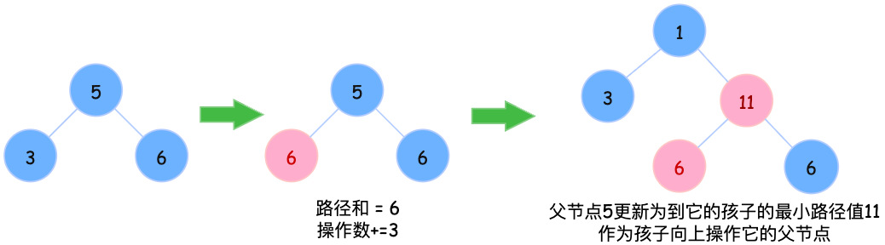

# [基础算法学习] 贪心在二叉树中的巧妙应用——使所有路径值相等的最小代价

**题目链接**：[LeetCode 2673. 使二叉树所有路径值相等的最小代价](https://leetcode.cn/problems/make-costs-of-paths-equal-in-a-binary-tree/description/?envType=problem-list-v2&envId=binary-tree)

---

## 题意理解

首先需要理解什么是**路径值**：从根节点 `root` 出发到达任意叶子节点的路径上，所有节点花费的总和。其中节点 `i` 的花费为 `cost[i-1]`（树的节点编号从 1 开始，数组 `cost` 下标从 0 开始）。

## 贪心思路

题目要求**最小代价**，这提示我们可以从贪心的角度思考问题。

对于任意一个子树（包含一个父节点和两个子节点），如果两个子节点到叶子的路径值不同，那么从父节点出发到叶子的路径值必然也不同。

让代价较小的子节点增加到与较大者相等，此时的操作次数为 `max(left, right) - min(left, right)`，即两者的差值。

参考下图示例：



---

## 算法流程

采用**自底向上**的处理方式：

1. 从最底层的叶子节点开始，逐层向上处理
2. 对于每对兄弟节点，计算它们路径值的差值，累加到答案中
3. 将父节点的值更新为：`parent += max(left, right)`
4. 这样父节点就包含了到其子树叶子节点的完整路径值，可以继续向上传递

## 代码实现
```python
class Solution:
    def minIncrements(self, n: int, cost: List[int]) -> int:
        ans = 0
        # 从倒数第二层开始，每次处理一对兄弟节点
        for i in range(n - 1, 0, -2):
            # 完美二叉树的性质：节点 i 和 i-1 是兄弟节点
            left = i - 1
            right = i
            parent = (i - 1) // 2  # 父节点索引
            
            # 累加使两个子节点路径值相等所需的操作数
            ans += abs(cost[left] - cost[right])
            
            # 更新父节点的值，使其包含到子树叶子的最大路径值
            cost[parent] += max(cost[left], cost[right])
            
        return ans
```

## 复杂度分析
**时间复杂度**：O(n)，遍历所有节点一次

**空间复杂度**：O(1)，只使用常数额外空间（原地修改 cost 数组）

