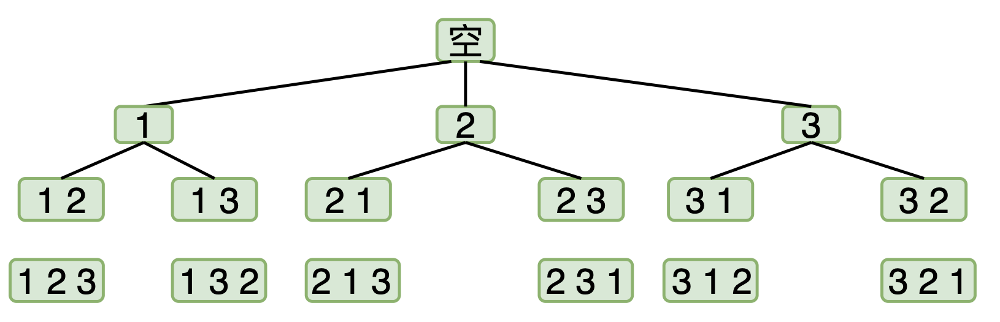

# [基础算法学习]回溯法(一)：万能模板+全排列问题解析

---

## 什么是回溯？
想象你在走一个迷宫。当你来到一个岔路口时，因为不知道哪条路通向出口，你只能**先选择其中一条路**走下去。
如果在路上又遇到岔路，你就继续选择一条路深究。直到你发现走到了死路，你不得不**原路返回**到上一个岔路口，撤销刚才的选择，尝试另一条没走过的路。重复这个过程，直到找到出口。
这种**一条路走到黑的搜索策略**，就是**深度优先搜索（DFS）**；而那个发现走不通、**退回上一步**换个方向的动作，就是**回溯**。

## 全排列的例子
为了让你更好地理解回溯算法，这里详解一个最经典的例子——**全排列**

>给定一个不含重复数字的数组```nums = [1, 2, 3]``` ，请你返回它们的所有可能排列。
>
>预期输出： ```[[1,2,3], [1,3,2], [2,1,3], [2,3,1], [3,1,2], [3,2,1]]```

### 直观想法：
这个版本利用排版优势，让读者一眼就能看清“深入”和“回退”的层次感。
### 直观推演
第 1 步： 面对初始集合 ```[1, 2, 3]```，我们任选一个数字作为开头，假设选择了 1。

第 2 步： 因为 1 已经被占用，接下来的选择范围就缩小为 ```[2, 3]```。假设这一次我们选择了 2。

第 3 步： 此时手里只剩下 3，别无选择，直接填入。

-> 结果达成： 我们找到了一条有效路径 ```[1, 2, 3]```。

此时路已走通，我们需要回溯：
先退回到第 2 步：刚才选的是 2，这次我们换个方向，选择 3。于是，最后剩下的 2 填入末尾，得到了新排列 ```[1, 3, 2]```。
再退回到第 1 步：也就是回到起点。刚才开头选了 1，这次我们换成 2 开头。重复上述过程，我们就能得到 ```[2, 1, 3]``` 和 ```[2, 3, 1]```。

### 图解


## 核心:回溯法的万能模版
```python
def backtrack(路径, 选择列表):
    """
    路径：代表你当前所在的这条路
    选择列表：代表你可以选择接下来走的路径
    """
    if 满足结束条件:
        result.add(路径)
        return
    
    for 选择 in 选择列表:
        做选择
        # 这里进行递归，将当前的路径和新的选择列表继续进行backtrack
        backtrack(路径, 新的选择列表)
        # 走完这条路后，后撤到当前位置，遍历下一种路径选择
        撤销选择
```

## 全排列算法代码实现
```python
class Solution:
    def permute(self, nums: List[int]) -> List[List[int]]:
        res = []  # 存放最终结果
        path = [] # 存放当前的路径（就是目前的排列）

        def backtrack(nums):
            # 1. 结束条件：如果 path 的长度等于 nums 的长度
            if len(path) == len(nums):
                res.append(path[:]) # 注意：要拷贝一份 path，否则后续 path 改变会影响结果
                return

            # 2. 遍历选择列表
            for x in nums:
                # 排除不合法的选择：如果 x 已经在 path 里面了，就不能再选
                if x in path:
                    continue
                    
                # A. 做选择
                path.append(x)
                
                # B. 进入下一层决策树
                backtrack(nums)
                
                # C. 撤销选择 (回溯的精髓)
                path.pop()

        backtrack(nums)
        return res
```

## **推荐题单(套用模版阶段)**：
1. [46.全排列 (Medium)](https://leetcode.cn/problems/permutations/description/)
2. [77.组合 (Medium)](https://leetcode.cn/problems/combinations/)
3. [78.子集 (Medium)](https://leetcode.cn/problems/subsets/)
4. [17.电话号码的字母组合 (Medium)](https://leetcode.cn/problems/letter-combinations-of-a-phone-number/)

在掌握了基础的回溯模版之后，我们将在下一文介绍回溯的进阶——剪枝优化

如果这篇文章对你有帮助，不妨**点个赞 👍，留个收藏 ⭐**，你的支持是我持续创作的动力！

## 相关文章

- [[基础算法学习] 字符串匹配还在用暴力？(一) Horspool算法：高效的跳跃术](https://blog.csdn.net/qwertyui666/article/details/155365393)

---

