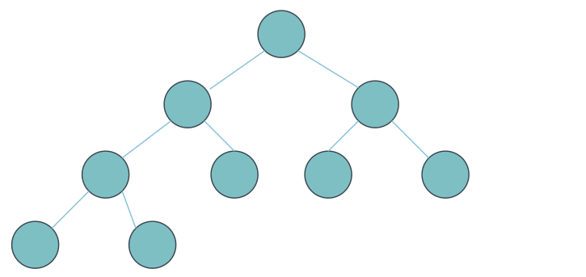

# 完全二叉树的节点个数，你真的会求吗？

**题目链接**：[LeetCode 222. 完全二叉树的节点个数](https://leetcode.cn/problems/count-complete-tree-nodes/)

---

## 暴力解法

求一个完全二叉树的节点个数，最直接的想法就是遍历整棵树的所有节点，时间复杂度为 $O(N)$。

**代码实现**：
```python
class Solution:
    def countNodes(self, root: Optional[TreeNode]) -> int:
        if not root:
            return 0
        return 1 + self.countNodes(root.left) + self.countNodes(root.right)
```

这里使用递归：`1 + self.countNodes(root.left) + self.countNodes(root.right)` 表示当前节点数 + 左子树节点数 + 右子树节点数。

但问题在于：**这个解法与完全二叉树毫无关系**，任何二叉树都可以用这个方法求解。

---

## 利用完全二叉树的性质优化

完全二叉树有以下重要性质：
1. 除了最后一层，其他层的节点都是满的
2. 最后一层的节点都集中在**左侧**

利用这些性质，我们可以优化算法。

### 核心思想

对于完全二叉树的根节点 `root`，它的左子树 `root.left` 和右子树 `root.right` 一定满足以下规律：

定义函数 $f(node)$ 表示以节点 `node` 为根的完全二叉树的节点个数，$h(node)$ 表示树的高度，则：

$$
f(root) = \begin{cases}
2^{h(root.left)} + f(root.right) & h(root.left) = h(root.right) \\
2^{h(root.right)} + f(root.left) & h(root.left) > h(root.right)
\end{cases}
$$

### 分类讨论

**情况 1：左右子树高度相同**

当 $h(root.left) = h(root.right)$ 时，根据完全二叉树的性质，左子树一定是**满二叉树**（因为最后一层优先填充左侧）。

此时：节点总数 = 左子树节点数 $2^{h(root.left)}$ + 右子树节点数 $f(root.right)$

**情况 2：左子树高度更高**

当 $h(root.left) > h(root.right)$ 时，说明最后一层还没填到右子树，因此右子树一定是**满二叉树**。

参考下图：



此时：节点总数 = 右子树节点数 $2^{h(root.right)}$ + 左子树节点数 $f(root.left)$

---

## 优化代码实现
```python
class Solution:
    def countNodes(self, root: Optional[TreeNode]) -> int:
        if not root:
            return 0
        
        # 计算左右子树高度
        left_height = self.getHeight(root.left)
        right_height = self.getHeight(root.right)
        
        if left_height == right_height:
            # 左子树是满二叉树
            return (1 << left_height) + self.countNodes(root.right)
        else:
            # 右子树是满二叉树
            return (1 << right_height) + self.countNodes(root.left)
    
    def getHeight(self, node: Optional[TreeNode]) -> int:
        """计算树的高度（只需沿着左侧路径）"""
        height = 0
        while node:
            height += 1
            node = node.left
        return height
```

### 复杂度分析

- **时间复杂度**：$O(\log^2 N)$
  - 每次递归需要 $O(\log N)$ 计算高度
  - 最多递归 $O(\log N)$ 层
  
- **空间复杂度**：$O(\log N)$（递归栈深度）

相比暴力解法的 $O(N)$，这是一个显著的优化！

---

## 小技巧

- `1 << k` 等价于 $2^k$，位运算更高效
- 计算高度时只需沿着**左侧路径**，因为完全二叉树的左侧最深